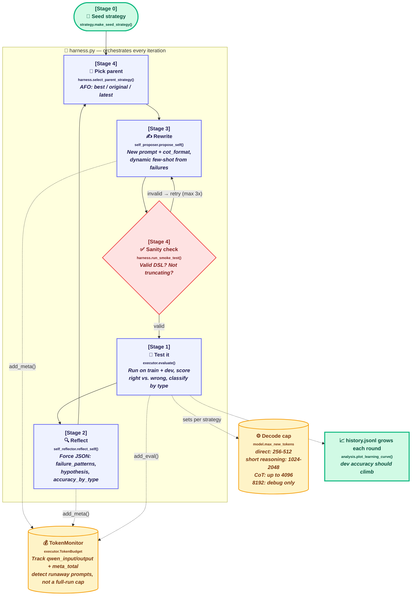

# 🚀 Project Evo (The Alpha-Quant Initiative)

**FROM:** Lead AI Engineering Team  
**TO:** Newly Onboarded Developer  
**SUBJECT:** Welcome to Project Evo  

Welcome to the team! We are thrilled to have you here. 

Right now, our biggest bottleneck as a firm is reading dense Vietnamese financial reports. We need to extract key metrics and write mathematical programs to solve financial equations automatically. Standard AI prompting isn't accurate enough for this. We need a system that can evolve.

We have built the skeleton for **EvoAgent**—a self-improving AI loop designed to optimize its own prompt system by reflecting on its own errors and rewriting its logic. 

## Quick Start

The assignment is a folder inside the `Advanced-NLP06` repository. Use Git's
**sparse checkout** to download only `assignment03` and ignore the other assignments:

```bash
git clone --depth 1 --filter=blob:none --sparse https://github.com/vietai-courses/Advanced-NLP06.git
cd Advanced-NLP06
git sparse-checkout set assignment03
cd assignment03
```

Create an isolated Python environment (Python 3.10–3.12 is recommended):

**macOS/Linux**

```bash
python3 -m venv .venv
source .venv/bin/activate
python -m pip install --upgrade pip
```

**Windows PowerShell**

```powershell
py -m venv .venv
.\.venv\Scripts\Activate.ps1
python -m pip install --upgrade pip
```

Confirm that the local CLI is available:

```bash
python main.py --help
```

The local environment runs the full EvoAgent loop, graders, and proof
generation. Model inference happens on a **Cerebrium**-hosted vLLM
OpenAI-compatible server, so no local NVIDIA GPU is required. Continue with
**Phase 1: Booting the Lab** below to deploy the inference endpoint and
configure your Hugging Face token.

> [!IMPORTANT]
> Never commit access tokens, `.env` files, virtual environments, downloaded model
> weights, run outputs, or generated proof/submission artifacts. Store `HF_TOKEN`
> in the local `.env` file (gitignored) and in a Cerebrium secret as described below.

However, the core logic engine is currently empty. We have left the boilerplate structure intact so you don't have to start from scratch, but you will find `TODO` blocks where the actual AI orchestration needs to go.

**Your Onboarding Mission:**
You have exactly two weeks to complete this build. Your mission is split into two milestones:

1. **The Baseline (6 Points):** Rebuild the core evolution loop, get it running end-to-end, and hit our baseline score of 40% accuracy on the Dev set. 
2. **The Global Leaderboard (4 Points):** 40% is just passing. The remaining 4 points are allocated to the developers who achieve the highest accuracy on the hidden Test Set. Track token and compute usage, prevent runaway generations, and document major model/API usage in your final report.

The technical briefing from the engineering team is attached below.

---

## 🧠 Technical Briefing: How EvoAgent Works

*(See `data_description.md` for full details on the dataset and the FinQA DSL syntax).*



## 📂 Your Arsenal (The Codebase)

Do not get overwhelmed. You only need to edit the files marked with "**[Stage X]**".

**The Core Engine (Where you write code):**
- `src/sandbox.py` — [Stage 0] Zero-shot baseline prediction sandbox.
- `src/executor.py` — [Stage 1] Evaluation engine and token budget tracking.
- `src/self_reflector.py` — [Stage 2] Error analysis and failure category logger.
- `src/self_proposer.py` — [Stage 3] Strategy proposer and dynamic few-shot generator.
- `src/harness.py` — [Stage 4] Iterative optimization loop and parent strategy selection.

**The Infrastructure (Do not touch):**
- `main.py` / `submit.py` / `run_cerebrium.py` — Your CLI runners and milestone job scripts.
- `src/model.py` / `src/evaluator.py` / `src/strategy.py` — OpenAI-compatible HTTP inference client (Cerebrium/vLLM), DSL execution, and dataclasses.
- `cerebrium.toml` — Cerebrium deployment config for the vLLM inference server.
- `graders/` — Step-by-step local validation suites (runs instantly to check your work).

---

## ⚙️ Phase 1: Booting the Lab

Before you build the AI, get your environment running.

### 1. Install Dependencies:
```bash
python -m venv son_env
source son_env/bin/activate  # On Windows PowerShell: .\son_env\Scripts\Activate.ps1
pip install -r requirements.txt
```

### 2. Deploy the Inference Server on Cerebrium

Model inference runs on a Cerebrium-hosted vLLM OpenAI-compatible server (A10
GPU, 24 GB VRAM). The EvoAgent loop itself runs locally and calls the endpoint
over HTTP.

1. Go to <https://cerebrium.ai/> and create an account.
2. Install and log in to the CLI:
   ```bash
   pip install cerebrium
   cerebrium login
   ```
3. In the Cerebrium dashboard, add a **Secret** named `HF_TOKEN` with your
   HuggingFace token (the server needs it to download model weights).
4. Deploy from this folder:
   ```bash
   cerebrium deploy
   ```
5. Billing note: track your usage in the Cerebrium dashboard. The app scales
   to zero when idle; set `min_replicas = 1` in `cerebrium.toml` only during
   long proof runs to avoid cold starts, and set it back afterwards.

### 3. Configure the local `.env` (Required for tokenizer and endpoint access)

Create/fill `.env` in this folder (already gitignored):

```
HF_TOKEN=hf_your-token
CEREBRIUM_BASE_URL=https://api.aws.us-east-1.cerebrium.ai/v4/p-<PROJECT_ID>/assignment03/v1
CEREBRIUM_API_KEY=<your Cerebrium inference token from the dashboard>
CEREBRIUM_MODEL=QuantTrio/Qwen3.5-4B-AWQ
```

All entry points (`main.py`, `run_cerebrium.py`, `submit.py`) load this file
automatically.

---

## 🎯 Phase 2: The Milestone Graders (Your 6 Points)

*Do not try to build the whole system at once. Complete each stage by filling in the TODO blocks, then run the corresponding auto-grader to claim your dopamine hit and secure your points.*

If you lose your place, use this quick-access checklist to catch anything you missed:

- [ ] Cerebrium login: `cerebrium login`
- [ ] HuggingFace secret in Cerebrium dashboard: `HF_TOKEN`
- [ ] Deploy inference server: `cerebrium deploy`
- [ ] Fill `.env`: `CEREBRIUM_BASE_URL`, `CEREBRIUM_API_KEY`, `HF_TOKEN`
- [ ] Stage 0 sandbox run: `python run_cerebrium.py sandbox`
- [ ] Stage 0 grader: `python graders/grade_stage0.py`
- [ ] Stage 1 grader: `python graders/grade_stage1_executor.py`
- [ ] Stage 2 grader: `python graders/grade_stage2_reflector.py`
- [ ] Stage 3 grader: `python graders/grade_stage3_proposer.py`
- [ ] Stage 4 smoke proof: `python run_cerebrium.py smoke`
- [ ] Stage 4 smoke grader: `python graders/grade_smoke_proof.py`
- [ ] Stage 4 confidence run: `python run_cerebrium.py test`
- [ ] Stage 4 full proof run: `python run_cerebrium.py main`
- [ ] Stage 4 final grader: `python graders/grade_stage4_harness.py`

### Stage 0: "The Sandbox" (The Baseline)
- **Purpose**: Understand the raw, un-optimized zero-shot performance of the LLM.
- **Mission**: Implement run_sandbox_prediction() inside `src/sandbox.py`.
- **How to run**: Run `python run_cerebrium.py sandbox` (with the Cerebrium endpoint deployed and `.env` filled). It will run your zero-shot prediction on the first training example and automatically evaluate your baseline zero-shot accuracy on 50 dev examples, saving the results in the local `sandbox_proof.json` file.
- **Unlock**: `python graders/grade_stage0.py` (checks your sandbox code implementation and validates `sandbox_proof.json`).

### Stage 1: The Execution Engine & Token Vault
- **Purpose**: Track token consumption so you don't go bankrupt in the Crucible.
- **Mission**: Implement TokenBudget tracker and evaluate() loop inside src/executor.py.
- **Unlock**: `python graders/grade_stage1_executor.py`

### Stage 2: The Critic (Self-Reflection)
- **Purpose**: Force the LLM to output structured JSON categorizing its mistakes (e.g., wrong unit, DSL errors).
- **Mission**: Implement progressive context decay and JSON coercion inside src/self_reflector.py.
- **Unlock**: `python graders/grade_stage2_reflector.py`

### Stage 3: The Architect & Dynamic Few-Shot
- **Purpose**: Use Stage 2's failures to dynamically inject targeted few-shot examples into the new prompt.
- **Mission**: Implement _is_valid_dsl_program() and dynamic few-shot extraction in src/self_proposer.py.
- **Unlock**: `python graders/grade_stage3_proposer.py`

### Stage 4: AFO Orchestration & Smoke Testing
- **Purpose**: Tie it all together using Best-Parent (AFO) selection so the AI doesn't regress.
- **Mission**: Implement run_smoke_test(), select_parent_strategy(), and run_evoagent() in src/harness.py.
- **Sanity check**: Run `python run_cerebrium.py smoke` after implementing `run_smoke_test()`. A successful run writes `smoke_proof.json` locally.
- **Smoke proof grader**: `python graders/grade_smoke_proof.py` validates `smoke_proof.json`.
- **Recommended confidence run**: Run `python run_cerebrium.py test` first. This is a smaller evolution run (train/dev 32) that catches integration issues before you spend time on the full run.
- **Full proof run**: Run `python run_cerebrium.py main` when you are confident. This run generates `evolution_proof.json` directly in this folder (and in `runs/exp_self/`).
- **Unlock**: `python graders/grade_stage4_harness.py` (checks your harness code implementation and validates `evolution_proof.json`; requires best dev accuracy >= 54%).
- **Final submission**: Follow `docs/THINKFLIC_SUBMISSION.md` for the ThinkFlic folder structure, report, evidence files, and video link.

---

## 🏆 Phase 3: The Global Kaggle Challenge

If your Stage 4 grader passes, congratulations! You have successfully built a working, self-evolving AI, and you have officially locked in your 6 baseline points 🎉. Take a moment to celebrate 🎊🎊🎊.

But... 54% accuracy is just the beginning. The final 4 points of this project are reserved for the leaderboard. 

For this final phase, the training wheels come off. 

Your goal is to optimize your EvoAgent to achieve the highest possible accuracy on the hidden Kaggle Test Set.

How you improve the system from here is entirely up to your team's creativity and engineering skills. 

👉 **[Read `docs/PHASE3_KAGGLE.md` for Kaggle rules and scoring, then `docs/THINKFLIC_SUBMISSION.md` for the final assessment package.]**
