# 🗺️ Flow toàn hệ thống — Giai đoạn 2 (Phase 3 Kaggle)

> Sơ đồ đồng bộ với [PHASE2_PLAN.md](PHASE2_PLAN.md), vẽ theo phong cách phần
> *Technical Briefing: How EvoAgent Works* trong [README](../README.md).
> Baseline LB **0.59919** → mục tiêu **≥0.78**.

```mermaid
graph TD
    classDef action fill:#eef2ff,stroke:#6366f1,stroke-width:2px,color:#1e1b4b,font-weight:bold;
    classDef code fill:#ffffff,stroke:#a5b4fc,stroke-width:1px,color:#6366f1,font-size:12px,font-style:italic;
    classDef gate fill:#fee2e2,stroke:#ef4444,stroke-width:2px,color:#7f1d1d,font-weight:bold;
    classDef vault fill:#fef3c7,stroke:#f59e0b,stroke-width:2px,color:#78350f,font-weight:bold;
    classDef start fill:#d1fae5,stroke:#10b981,stroke-width:3px,color:#064e3b,font-weight:bold;
    classDef opt fill:#f3e8ff,stroke:#a855f7,stroke-width:2px,color:#3b0764,font-weight:bold;

    START(["<b>[P0]</b><br/>🌱 Seed 2 strategies<br/><span style='font-size:11px'>strategy_s4fix.json + strategy_retr_base.json</span><br/><i>A = few-shot cố định đã sửa (fix #4)<br/>B = nền s4fix + retrieval per-question</i>"]):::start

    RESCORE{"<b>[P1]</b><br/>♻️ Rescore offline<br/><span style='font-size:11px'>extraction_v2 + evaluator_v2 trên raw_output CŨ</span><br/><i>Gate A0: 0.579 → ~0.63 (≥+3pp mới đi tiếp)</i>"}:::gate

    subgraph GEN["🧭 predict.py generate — sinh candidates (per câu × strategy)"]
        RETR["<b>[P5]</b><br/>🔎 Retrieval few-shot<br/><span style='font-size:11px'>retrieval.py — TF-IDF kNN top-8→3 shot</span><br/><i>chỉ cho strategy B (gate dev)</i>"]:::action

        DEC["<b>[P2/P3]</b><br/>🎲 2 decode groups<br/><span style='font-size:11px'>model.complete_many(n)</span><br/><i>Greedy n=1 temp0 rep1.05<br/>Sampled n=7 temp0.6 top_p0.95 top_k20</i>"]:::action

        EXTRACT["<b>[P3]</b><br/>📤 Extraction v2<br/><span style='font-size:11px'>extraction_v2.extract_program_v2</span><br/><i>JSON-sau-think ưu tiên, không mót rác</i>"]:::action

        REPAIR{"<b>[P3]</b><br/>🩹 Repair pass?<br/><span style='font-size:11px'>rỗng / runaway / execute crash</span><br/><i>re-ask guided JSON 1 lần</i>"}:::gate

        RETR --> DEC
        DEC --> EXTRACT
        EXTRACT --> REPAIR
        REPAIR -->|"hỏng → re-ask"| DEC
    end

    EVAL["<b>[P1/P4]</b><br/>⚙️ Evaluator v2 (execute)<br/><span style='font-size:11px'>evaluate_program_v2</span><br/><i>flatten nested · fuzzy row · accounting neg</i>"]:::action

    VOTE{"<b>[P4]</b><br/>🗳️ Voting self-consistency<br/><span style='font-size:11px'>voting.py — 16 candidates → cluster theo GIÁ TRỊ</span><br/><i>conf≥0.5 & members≥3 & margin≥0.15?</i>"}:::gate

    JUDGE["<b>[P7 · OPTIONAL]</b><br/>⚖️ LLM Judge R1-7B<br/><span style='font-size:11px'>judge.py — DeepSeek-R1-Distill (swap model)</span><br/><i>chỉ câu needs_judge · execution-first · fallback majority</i>"]:::opt

    SUBMIT["<b>[P6/P8]</b><br/>📦 Tổng hợp kết quả<br/><span style='font-size:11px'>predict.py submit → test_predictions.json {id:value}</span>"]:::action

    FORMAT["<b>[P8]</b><br/>🧾 format_submission.py<br/><span style='font-size:11px'>DÙNG NGUYÊN TRẠNG</span><br/><i>3 cột id,Usage,predicted_value · điền 0.0 câu thiếu</i>"]:::action

    CHECK{"<b>[P8]</b><br/>✅ Sanity gate<br/><span style='font-size:11px'>predict.py check</span><br/><i>đủ 494 id · #0.0 ≤ 10 · runaway <5% · no sci-notation</i>"}:::gate

    DONE(["<b>[P8/P9]</b><br/>🏁 submission.csv → Kaggle<br/><span style='font-size:11px'>+ re-run 6 graders (P9)</span><br/><i>mục tiêu ≥0.78</i>"]):::start

    CACHE[("💾 PredictionCache (JSONL)<br/><span style='font-size:11px'>pipeline_v2.py — key (qid,strategy,sample)</span><br/><i>append crash-safe · resume · --retry-failed</i>")]:::vault
    RELIAB[("🔁 Reliability layer<br/><span style='font-size:11px'>complete_many retry+backoff+jitter</span><br/><i>không bao giờ trả '' im lặng · re-queue</i>")]:::vault
    BUDGET[("💰 TokenBudget<br/><span style='font-size:11px'>executor.py (tái dùng)</span><br/><i>qwen in/out + judge in/out → token_usage.json</i>")]:::vault
    ARTIF[("🗂️ runs/phase3/<br/><span style='font-size:11px'>run.log · ablation_*_eval.json · test_details.json</span><br/><i>schema iter_XXX_eval_dev.json</i>")]:::vault

    START --> RESCORE
    RESCORE -->|"≥+3pp"| RETR
    REPAIR -->|"ok"| EVAL
    EVAL --> VOTE
    VOTE -->|"đồng thuận → accept value"| SUBMIT
    VOTE -.->|"needs_judge (~20-35%)"| JUDGE
    JUDGE -.->|"verdict / fallback"| SUBMIT
    SUBMIT --> FORMAT
    FORMAT --> CHECK
    CHECK -->|"fail → fixup / retry-failed"| SUBMIT
    CHECK -->|"pass"| DONE

    DEC -.->|"mỗi sample ghi ngay"| CACHE
    DEC -.->|"lỗi transient"| RELIAB
    RELIAB -.-> DEC
    CACHE -.->|"resume"| EVAL
    DEC -.->|"add usage"| BUDGET
    JUDGE -.->|"add usage"| BUDGET
    VOTE -.-> ARTIF
    CHECK -.-> ARTIF
```

## Chú giải

- **Trục xanh (START → DONE)** = critical path **P0→P6 + P8**; bỏ hẳn nhánh judge vẫn ra submission A4 hợp lệ.
- **Gate đỏ** = 4 chốt quyết định: rescore A0 (≥+3pp), repair, vote consensus, sanity `check`.
- **Nhánh tím `[P7 OPTIONAL]`** (nét đứt) nằm *ngoài critical path* — chỉ bật khi hội đủ 3 điều kiện §3.7.
- **4 "kho" vàng** xuyên suốt: PredictionCache (resume), Reliability (retry), TokenBudget, artifacts `runs/phase3/`.
